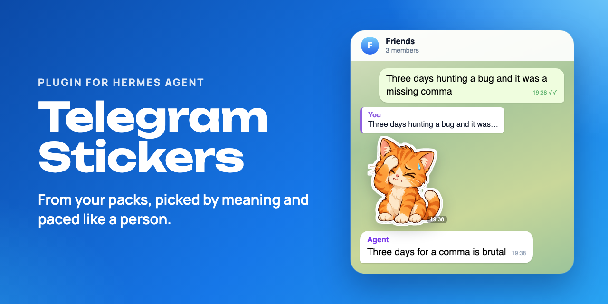
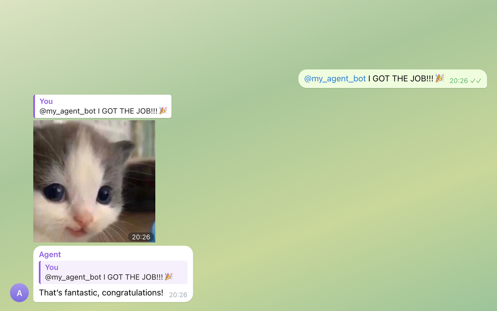
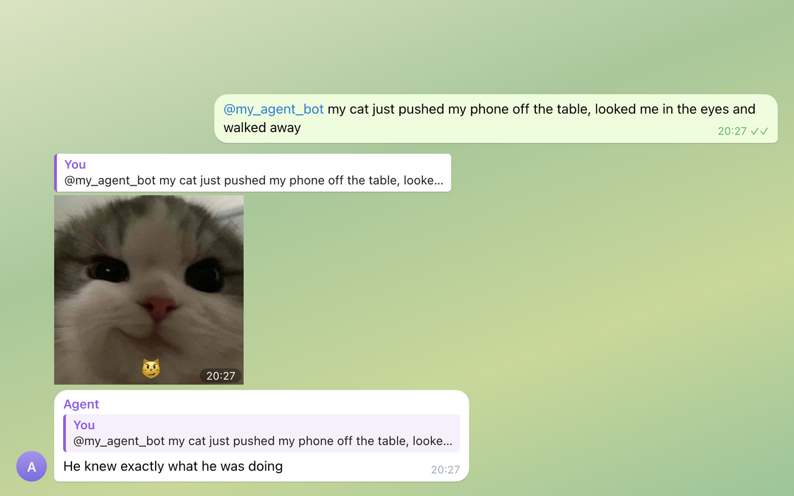
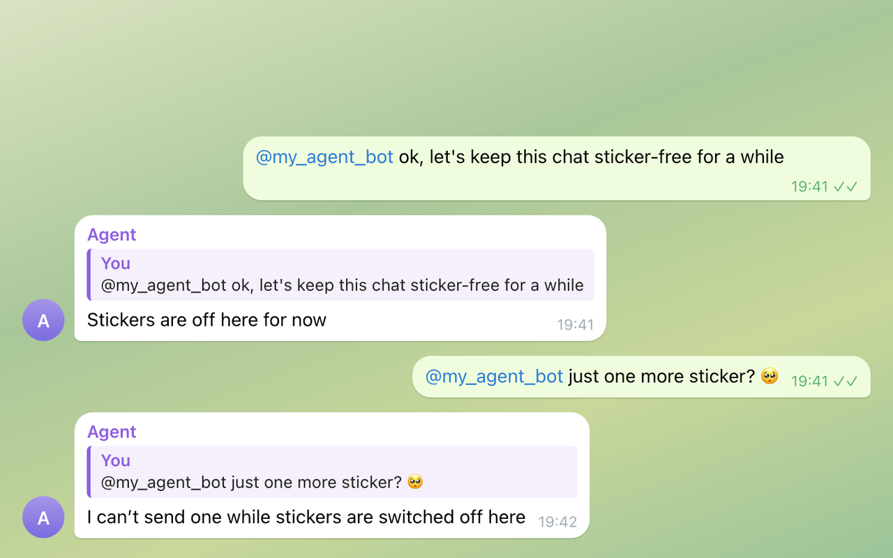

# Telegram Stickers for Hermes Agent

**Lets your Hermes agent answer with Telegram stickers: default packs out of the box or packs you choose, picked by emoji or by meaning, sent as a reply in the right topic, paced like a person.**

[](https://github.com/churnast/hermes-telegram-stickers/actions/workflows/ci.yml)
[](https://github.com/churnast/hermes-telegram-stickers/releases)
[](LICENSE)
[](https://www.python.org)
[](https://hermes-agent.nousresearch.com)



[Hermes Agent](https://hermes-agent.nousresearch.com) is an open-source AI agent from Nous Research; on Telegram it talks as your bot. Out of the box it cannot send stickers. This plugin lets it reply with stickers: from four default packs at first, then from the packs you choose.


*Re-drawn from live test chats; names replaced. [MP4 version](docs/demo.mp4).*

---

## 🚀 Quick start

You need Hermes Agent 0.20.6 or newer with its Telegram gateway set up (`hermes gateway setup`); 0.21.5 or newer to run every `/stickers` command in Telegram (see Known limitations). A vision model is needed only for step 4. No extra Python packages.

**1. Install, enable and restart the gateway.** Hermes 0.21.3 and newer warn that the source is not from their catalog; Hermes asks for `TELEGRAM_BOT_TOKEN` (the token your gateway already uses) only if it does not have it yet. If you run `hermes gateway` in a terminal, stop it and start it again instead of `restart`.

```bash
hermes plugins install churnast/hermes-telegram-stickers --enable
hermes gateway restart
```

**2. Pick your packs.** Send your bot a few stickers you like in a direct chat: their packs are added automatically. Or set packs by name, favourite first (the part after `t.me/addstickers/`, or the whole link; any public pack works), then restart the gateway again. Until you do either, four packs made by Telegram work out of the box. If other people can message your bot directly, their stickers add packs too: keep the gateway allowlist to yourself, or set `learn_packs` to `false`.

```bash
hermes config set plugins.entries.telegram-stickers.settings.packs '["MyFavouritePack", "AnotherPack"]'
```

**3. Check it in Telegram.** In a direct chat with your bot, send `/stickers`. It lists your packs, starting with a line like `Stickers: 42 in 2 pack(s), 0 with a description.` (Before Hermes 0.21.5, learned packs show there only as a count; `/stickers` in the Hermes CLI names them.) Then ask the bot for a sticker.

**4. Optional: pick by meaning.** Send `/stickers describe` in the same chat (before Hermes 0.21.5, in the Hermes CLI on the server: run `hermes`, then `/stickers describe`). Your vision model describes up to 30 stickers per run; send it again for the next batch.

---

## 🐾 What you get

*From live test chats on 5 October 2026, where the agent was also told to prefer a sticker to a lone emoji; the off-switch scene is from a separate run. Usage footers and some messages are left out; pacing was reset between scenes.*

**Picks the moment.** Nobody asked for a sticker: happy news gets a kitten as a reply.



**Picks by meaning.** A smug cat gets a smug kitten (the sticker it sent is tagged 😼).



**An off switch that sticks.** Ask once, it stays off: the plugin gives the agent no tool to switch stickers back on; only `/stickers on` does.



**What it adds:** three tools, the `/stickers` command, a skill and a hook that adds a short sticker hint on Telegram turns where a sticker is allowed; to learn packs from stickers you send, also a Telegram handler (see Privacy and safety).

- `telegram_sticker_send`: sends one sticker, picked by a few words, a reaction ("facepalm"), an emoji or an id, as a reply in the current topic.
- `telegram_sticker_find`: lists your packs and emojis, or finds stickers.
- `telegram_sticker_mute`: switches stickers off in the chat when someone asks; only `/stickers on` undoes it (see /stickers commands for where it works).
- `telegram-stickers:sticker-etiquette` skill: when a sticker fits and when words are better.

## 💬 /stickers commands

| Command | Where | What it does |
|---|---|---|
| `/stickers` | any chat | Packs (yours, learned or default), described stickers, on or off here. In a direct chat, also muted chats with ids; in a group, learned packs only as a count. |
| `/stickers sync` | any chat | Reloads the packs from Telegram. |
| `/stickers off`, `/stickers on` | any chat (Hermes 0.21.5 and newer) | Switches stickers off or on in this chat. |
| `/stickers describe [n]` | direct chat | The vision model describes up to `n` undescribed stickers (default 30), learned packs first, newest first. |
| `/stickers describe again [n]` | direct chat | Redoes descriptions from an older prompt or Hermes' cache, never your own. |
| `/stickers off <chat id>`, `/stickers on <chat id>` | direct chat | The same for another chat, by its id. |
| `/stickers ban <id>`, `/stickers unban <id>` | direct chat | Takes a sticker out of use, or brings it back. |
| `/stickers about <id> <text>` | direct chat | Replaces a sticker's description with your text. |
| `/stickers forget <pack>` | direct chat | Removes a pack learned from your stickers. Sending a sticker from it adds it back. |

Sticker ids look like `MyFavouritePack:12`; the agent's `telegram_sticker_find` tool shows them. Commands that change your stickers or other chats are direct-chat only, since anyone in a group may be able to run slash commands.

Before Hermes 0.21.5, Hermes does not tell plugins which chat a slash command came from. In Telegram, `/stickers` then shows the status (learned packs only as a count, no muted chats) and `/stickers sync` reloads the packs; the other commands, `/stickers off` and `/stickers on` included, answer that they work in the Hermes CLI on the server. There (`hermes`, then `/stickers ...`) they all work, and `off` and `on` need a chat id. To switch stickers off in one chat, you can also ask the agent there.

## 🔧 Configuration

Set any of these like `packs` in Quick start (`hermes config set plugins.entries.telegram-stickers.settings.<name> <value>`), then restart the gateway. [config.example.yaml](config.example.yaml) shows them all.

| Setting | What it does |
|---|---|
| `packs` | Pack short names or `t.me/addstickers/...` links, favourite first (earlier packs win ties). |
| `learn_packs` | A sticker you send the bot in a direct chat adds its pack (not in groups; not forwarded, except on Hermes 0.20.6). There is no limit: a learned pack stays until `/stickers forget` or until Telegram no longer has it. Anyone who messages the bot directly adds packs too, so on a bot several people use, set `false`. Default `true`; `false` stops learning, and learned packs are not used. |
| `default_packs` | While there are no packs from `packs` or learning, use four packs made by Telegram: TheFoods, MelieTheCavy, OfficeTurkey and Animals. Default `true`. |
| `turn_hint` | On a Telegram turn where a sticker is allowed now, adds a short hint to that turn's message, so the agent answers jokes, news and emotions with stickers nobody asked for. Default `true`; `false` turns the hint off. |
| `cooldown_seconds` | Minimum seconds between two stickers in a chat. Default `20`; `0` turns this limit off. |
| `min_messages_between` | Minimum messages between two stickers in a chat, counted by Telegram message numbers, the bot's own messages included (in a direct chat, `6` is about every third message of yours). Default `6`; `0` turns this limit off. |
| `describe_batch` | Stickers per `/stickers describe` run, one vision call each. Default `30`. |
| `allow_other_chats` | Lets the agent send to another chat; the off switch and cooldown apply there, the message count does not. Default `false`. |
| `api_base` | Only for a self-hosted Bot API server. Use `https://`, or `http://` only on the same machine: the token is part of every request address. |

### Stickers nobody asked for

This works by itself, in direct chats and groups. On a Telegram turn where a sticker is allowed (stickers are on in that chat and pacing has passed), the plugin adds one short paragraph to the turn: a sticker may go out now, on a joke, banter, good or funny news or a strong emotion, never on serious matters and never instead of an answer. So the agent answers such moments with a sticker nobody asked for, and most messages still get words. `turn_hint: false` turns the hint off. A Hermes channel prompt for a chat can add your own taste on top, but it is not needed.

## 🧠 How it picks

A sticker carries one emoji, and the same 😂 can be a laughing cat or a crying frog, so the plugin matches the agent's words against short descriptions: what each sticker shows, plus a few reaction words.

- **Packs.** Your `packs` first, then packs learned from stickers you sent, newest first; the default packs only while both are empty. Earlier packs win ties.
- **Descriptions.** Hermes' own descriptions of static stickers people sent the bot are reused with no vision call. `/stickers describe` sends the rest, once each, to your vision model (animated and video stickers as a still preview), learned packs first, newest first, so a pack you just taught is described on the next run; a sticker that fails twice is not retried.
- **Pack names.** A word from a pack's title or short name counts too, also as a plural ("cherries" for Hot Cherry), but less than a sticker's own description, so that pack's stickers come up before they are described. A search limited to one pack where nothing fits lists that pack's stickers.
- **Reactions and emojis.** About forty common reactions map to the emojis and words that go with them, so "facepalm" finds a 🙄 sticker in a pack with no 🤦. Skin tones and gender signs do not matter, and a missing emoji falls back to the nearest one in feeling when the plugin knows one. With no such emoji either, the words of the emoji's Unicode name are searched in pack titles and descriptions, so 🍒 (cherries) finds a pack called Hot Cherry; otherwise the error lists your packs' emojis.
- **Pacing.** At most one sticker per 6 messages in a chat (Telegram message numbers, the bot's own messages included) and never two within 20 seconds, both kept across restarts; the last five sent there are skipped when another one fits. A sticker replies to the message being answered, in its forum topic; if that message is gone, it goes out without the reply.

---

## 🔒 Privacy and safety

- **Network.** Only the Telegram Bot API (`api.telegram.org` or your `api_base`), with the gateway's `TELEGRAM_BOT_TOKEN`:
  - `getStickerSet` for each pack in use (yours, learned or default) that the cached list does not have yet (for example a pack just learned) or loaded more than a week ago, and for all of them when the cached list is missing or in an older format or the bot changed; for every pack on `/stickers sync` and when the agent asks `telegram_sticker_find` to refresh.
  - `sendSticker` when the agent sends a sticker.
  - `getFile` and a file download per sticker that `/stickers describe` or `/stickers describe again` processes.
- **Vision model.** Only for `/stickers describe` and `/stickers describe again`, which you start. Each image, or its still preview, goes through a temporary file to Hermes' own vision call (and so to your vision provider), then is deleted. The model never gets a link with the token in it.
- **Learning packs** (`learn_packs`, on by default). A Telegram handler of the plugin sees stickers sent to the bot in direct chats, never in groups, skips forwarded ones, and keeps the pack name, the sticker kind and the sender's id in memory for up to an hour. A `pre_llm_call` hook keeps the pack once Hermes runs a turn for that sender in their own direct chat, so stickers from people Hermes does not answer are dropped. For learning, the hook reads the turn's platform and sender id and, only when the handler is not running, Hermes' note for a static sticker.
- **Sticker hint** (`turn_hint`, on by default). On a Telegram turn in a chat where stickers are on and pacing has passed (in a direct chat, only a turn with a sender), the same hook returns one fixed paragraph of about 450 characters (when a sticker fits and how to send it). Hermes appends it to that turn's user message, not to the system prompt, and keeps it with that message in the session history. It reads only the settings and `state.json`, never the network. Cron turns, subagents, muted chats and turns too soon after a sticker get no hint.
- **Files** in `<HERMES_HOME>/plugin-data/telegram-stickers/`: `catalog.json` (pack titles, emojis, file ids, the bot's numeric id), `descriptions.json`, `state.json` (muted chats, banned stickers, learned pack names with the sticker kind and when each was learned and last seen (every learned pack, until it is forgotten), and per chat the last five stickers sent with the time and message number of the latest) and `tmp/` (images being described, removed right away). It also reads Hermes' `sticker_cache.json`.
- **Token.** Read from the environment, never written or logged, and removed from tool errors and `/stickers` replies. An `api_base` without `https://` or `http://` is refused before any request.
- **Pack text.** Pack titles and most descriptions are third-party text (pack authors, a vision model). The tools pass it on unchanged, descriptions cut to 140 characters, marked as data, not instructions.
- **Who can do what.** The agent sends only to its current chat unless you allow other chats, and can switch stickers off there; none of its sticker tools switches them back on. In a group, anyone who can run the bot's slash commands can use the "any chat" commands (before Hermes 0.21.5, only `/stickers` and `/stickers sync`); `/stickers` there shows learned packs only as a count. The rest work only in a direct chat (before Hermes 0.21.5, only in the Hermes CLI; with `plugins.isolation: host`, nowhere), and the plugin treats every direct chat as yours, also when it learns packs: let only yourself message the bot directly (Hermes' gateway allowlists decide that). The agent's own tools work with every pack in use, so in a group the agent can still name a learned pack, for example in a sticker id like `pack_name:12`.
- **Not used:** background processes, shell commands, telemetry.

## 🚧 Known limitations

- **Telegram only**, and by default only in Telegram turns.
- **Packs, not your sticker list.** The Bot API cannot read your saved, recent or favourite stickers, so a pack is learned only from a sticker you send the bot in a direct chat while the gateway runs. Not learned: groups, forwarded stickers (where the plugin's Telegram handler runs, see below), custom emoji and masks, and a sticker whose turn never comes (it waits in memory, so a gateway restart drops it; send it again).
- **Every sticker you send counts**, even one you sent to ask about it, and the whole pack is used, not only that sticker. `/stickers forget <pack>` drops a pack; `/stickers ban <id>` takes out a single sticker.
- **Every direct chat teaches.** Each person Hermes answers in a direct chat adds packs, which the agent then uses in every chat. Keep the gateway allowlist to yourself, or set `learn_packs: false`.
- **Animated and video packs need the plugin's Telegram handler**, since Hermes' own note for them has no pack name; so does skipping forwarded stickers. Hermes 0.20.6 has no Telegram handlers for plugins. If Hermes did not run the handler, `/stickers` in a direct chat (Hermes 0.21.5 and newer) says that only static stickers are learned: add the others by name.
- **`/stickers` before Hermes 0.21.5.** In Telegram it does not know which chat it came from: there it shows the status and reloads packs, and the other commands work in the Hermes CLI on the server (see /stickers commands).
- **No hint on image turns on older Hermes.** Hermes 0.20.6 and 0.21.3 drop plugin context from a user message that carries an image as native content, so such a turn gets no sticker hint. Hermes 0.21.5 and later add it.
- **`plugins.isolation: host` (Hermes main).** There the plugin cannot see the current chat, so it cannot send stickers there, mute it, learn packs or add the sticker hint, and `/stickers` only shows the status and reloads packs: the other commands are refused, in Telegram and in the Hermes CLI. Use `in_process`.
- **Meaning needs descriptions.** Before `/stickers describe`, picking works mostly by emoji, reactions and pack names.
- **Tool search.** Plugin tools may sit behind `tool_search` (on by default), and plugin skills are not in the system prompt. The sticker hint names `telegram_sticker_send` and says to call it through `tool_call` when it is not listed, and the skill, once loaded with `skill_view`, says the same. With `turn_hint: false`, nothing points the agent to the hidden sticker tools unless it loads the skill or searches for them. `tools.tool_search.enabled: off` turns tool search off for every hidden tool.
- **Hermes internals.** `/stickers describe`, the current-chat lookup and learning from Hermes' sticker note use Hermes functions and text outside the plugin API, so a Hermes update could break them.

## 🩺 Troubleshooting

- **"No sticker packs yet".** Only with `default_packs: false`: send the bot a sticker in a direct chat or set `packs` (Quick start, step 2).
- **A sticker I sent did not add its pack.** Check that `learn_packs` is not `false`. Only direct chats count, not forwarded stickers (except on Hermes 0.20.6), and only once Hermes answers it. Send it again; `/stickers` in a direct chat (Hermes 0.21.5 and newer) lists the learned packs and says when learning is off or only static stickers can be learned. Before Hermes 0.21.5, `/stickers` in the Hermes CLI lists them.
- **"not loaded (Telegram refused getStickerSet: Bad Request: STICKERSET_INVALID.)" next to a pack.** Check the short name in `packs`: the part after `t.me/addstickers/`. A learned pack that Telegram no longer has is forgotten by itself.
- **"No sticker fits".** Run `/stickers describe` (after an update, `/stickers describe again`) so descriptions carry reaction words.
- **"the vision model gave no description".** Configure a vision model (`hermes setup`) and run `/stickers describe` again. Stickers that already failed twice are skipped; describe them with `/stickers about <id> <text>`.
- **The agent sends no stickers, or says it has no sticker tools.** Check that the plugin is enabled, `TELEGRAM_BOT_TOKEN` is set for the gateway (usually in `<HERMES_HOME>/.env`, by default `~/.hermes/.env`; without it the tools and the hint are off) and, on Hermes 0.21.5 and newer, `/stickers` says stickers are on here. Stickers nobody asked for need `turn_hint` on and come only where pacing allows, on jokes, news and emotions: most messages get words. See also Known limitations.
- **Stickers stay off in a group.** Send `/stickers on` there. If it never reaches the bot, send `/stickers` to the bot in a direct chat to get the chat id, then `/stickers on <chat id>`. Before Hermes 0.21.5, run `/stickers on <chat id>` in the Hermes CLI, where `/stickers` lists the chats where stickers are off.

---

## 🔄 Update and remove

```bash
hermes plugins update telegram-stickers
hermes plugins disable telegram-stickers   # off, but still installed
hermes plugins remove telegram-stickers
```

Restart the gateway after each. If Hermes refuses while the gateway runs, run `hermes gateway stop` first and `hermes gateway start` after. `remove` keeps `<HERMES_HOME>/plugin-data/telegram-stickers/`; delete it to drop the sticker list, descriptions, learned packs and muted chats.

---

**Development.** Offline tests and CI against Hermes Agent 0.20.6 and 0.21.5 (and main, as a warning): see [CONTRIBUTING.md](CONTRIBUTING.md). Changes: [CHANGELOG.md](CHANGELOG.md).

**Related.** [Memory Shield](https://github.com/churnast/hermes-memory-shield) keeps your agent from rewriting or wiping what it remembers about you.

**License.** [MIT](LICENSE) © 2026 churnast
